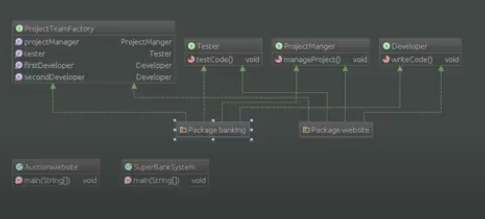

# Шаблон: Абстрактная фабрика (Abstract Factory)

---

## 🎯 Цель

Создание интерфейса, для создания множества взаимосвязанных или взаимозависимых объектов, без жёсткой
привязке к конкретным классам.

---

## 🛠️ Для чего используется

Для создания множеств взаимосвязанных объектов.

---

## 💡 Пример использования

- Система не должна зависеть от метода создания, компоновки и представления входящих в неё объектов;
- Входящие взаимосвязанные объекты должны использоваться вместе;
- Система должна конфигурироваться одним из множеств объектов, из которых она состоит;
- Нам необходимо предоставить множество объектов, раскрывая только их интерфейсы но не реализацию.

---

## Схема шаблона

