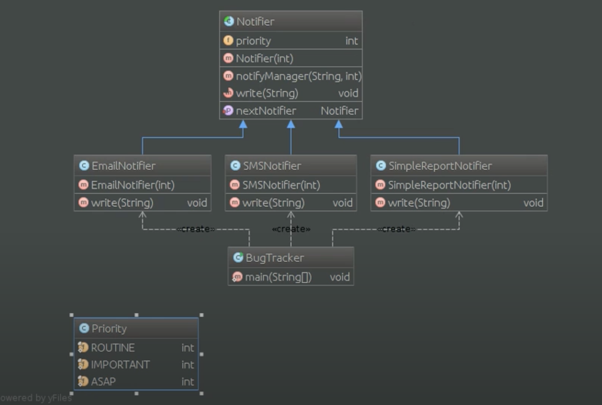

# Шаблон: Цепочка ответственности (Chain of responsibility)

---

## 🎯 Цель

Связывание объектов-получателей в цепочку и передача запросов по ней.

---

## 🛠️ Для чего используется

Помогает избежать привязки отправителя запроса к его получателю, что дает возможность обработать данный запрос нескольким объектам.

---

## 💡 Пример использования

- Ослабление привязанности (объект не должен знать, кто именно бработает его запрос).
- Дополнительная гибкость при распределении обязанностеймежду объектами.

---

## Схема шаблона

