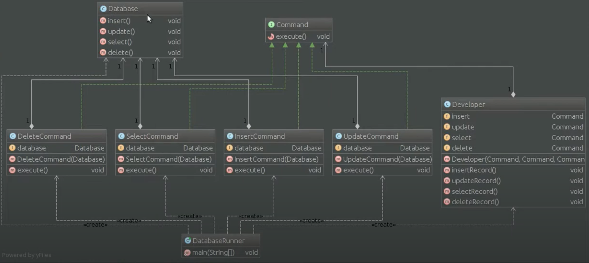

# Шаблон: Команда (Command)

---

## 🎯 Цель

Инкапсулирование запроса в объект.

---

## 🛠️ Для чего используется

Чтобы задать параметры клиентов для обработки определенных запросов, создание очереди из этих запросов или их контроля и поддержки отмены операций.

---

## 💡 Пример использования

- Параметризация объектов выполняемым действием.
- Определять запрос, ставить его в очередь или выполнять его в разное время.

---

## Схема шаблона

