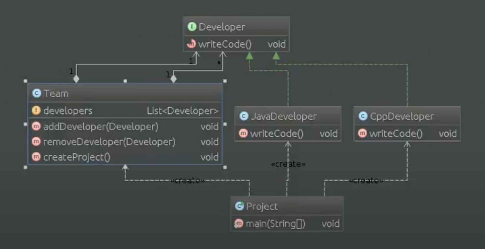

# Шаблон: Компановщик (composite)

---

## 🎯 Цель

Скомпонировать объекты в структуры по типу "дерева", позволяя клиентам единообразно трактовать отдельные и составные объекты.

---

## 🛠️ Для чего используется

Для группировки мелких компонентов в более крупные, которые, в свою очередь, могут стать основой для еще более крупных структур.

---

## 💡 Пример использования

- Для представления иерархии "часть-целое".
- Мы хотим, чтобы клиенты одним способом трактовали как отдельные, так и составные объекты.

---

## Схема шаблона

