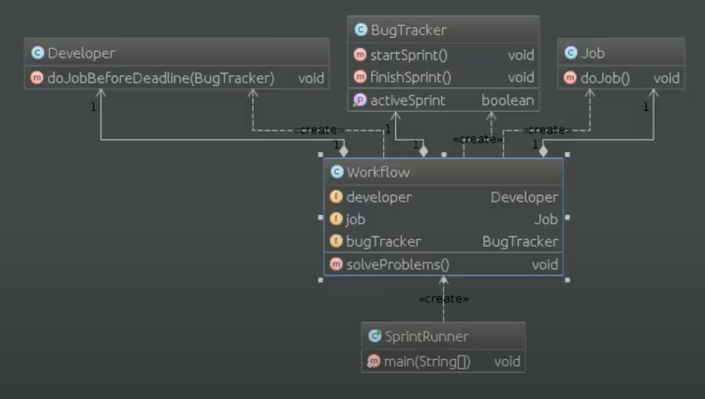

# Шаблон: Фасад (facade)

---

## 🎯 Цель

Предоставить унифицированный интерфейс вместо нескольких интерфейсов подсистемы.

---

## 🛠️ Для чего используется

Используется для определения интерфейса высокого уровня, который упрощает использование подсистемы.

---

## 💡 Пример использования

- Изолирование клиентов от компонентов подсистемы, упрощая работу с ней.
- Необходимость ослабления связанности подсистемы с клиентами.

---

## Схема шаблона

