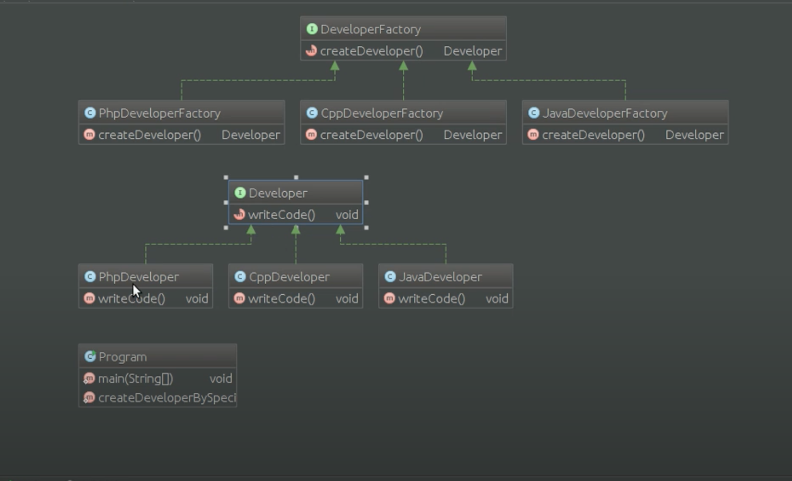

# Шаблон: Фабрика (Factory Method)

---

## 🎯 Цель

Создание интерфейса, который создаёт объект. При этом выбор того, экземпляр какого класса создавать,  
остаётся за классами, которые имплементируют данный интерфейс.

---

## 🛠️ Для чего используется

Для делегирования создания экземпляров другому классу.

---

## 💡 Пример использования

- Заранее неизвестно, экземпляры какого класса нужно будет создавать;
- Класс спроектирован таким образом, что создаваемые им объекты имеют свойства определённого класса.

---

## Схема шаблона

