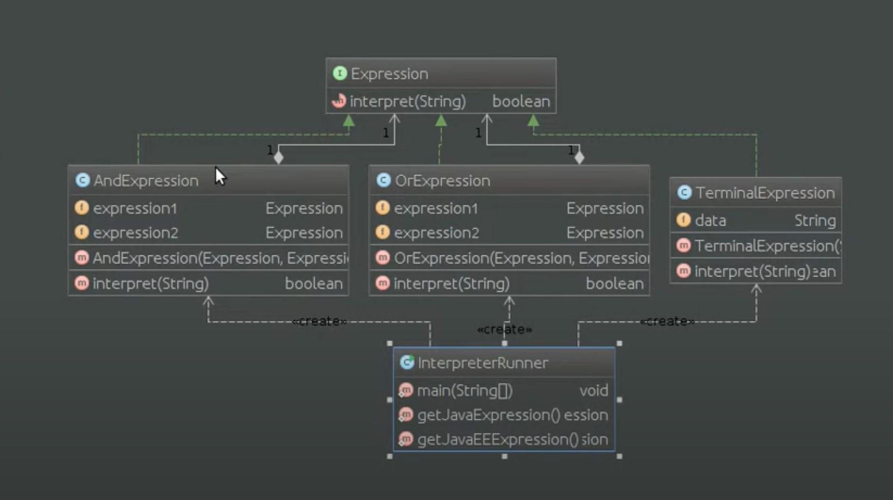

# Шаблон: Интерпретатор (Interpreter)

---

## 🎯 Цель

Определение представления грамматики объекта.

---

## 🛠️ Для чего используется

Используется для определение представления грамматики заданного языка и интерпретации его предложений.

---

## 💡 Пример использования

- Упрощение иерархии классов с помощью интерпретирования.

---

## Схема шаблона

