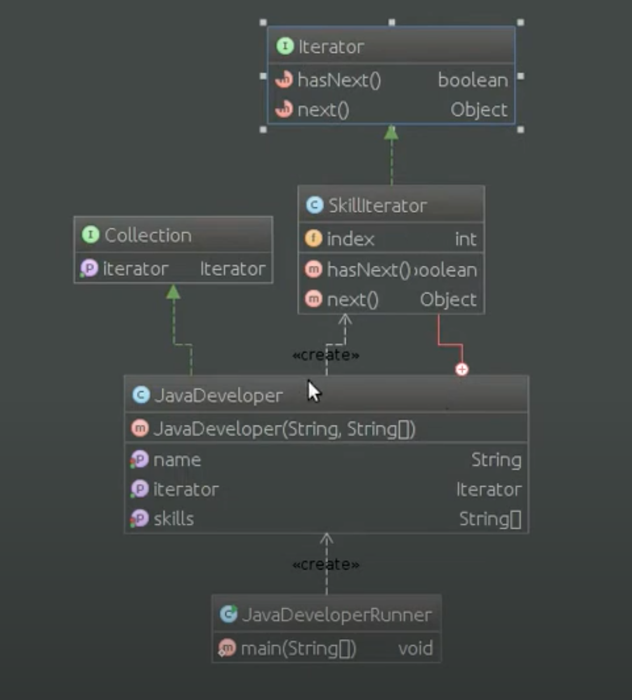

# Шаблон: Итератор (Iterator)

---

## 🎯 Цель

Получение последовательного доступа ко всем элементам составного объекта.

---

## 🛠️ Для чего используется

Для получения последовательного доступа ко всем элементам составного объекта, скрывая его внутреннее представление.

---

## 💡 Пример использования

- Различные виды обхода составного объекта.
- Упрощенный доступ к составному объекту.

---

## Схема шаблона

