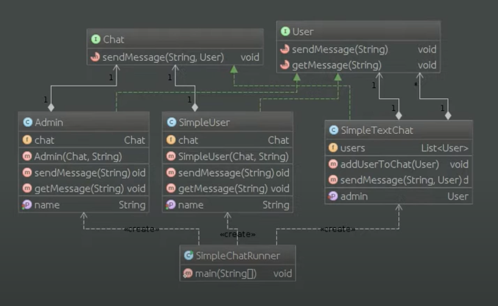

# Шаблон: Медиатор (Mediator)

---

## 🎯 Цель

Инкапсуляция способа взаимодействия множества объектов.

---

## 🛠️ Для чего используется

Для определения объекта, который инкапсулирует способ взаимодействия множества объектов и обеспечения слабой связи между этими объектами.

---

## 💡 Пример использования

- Связи между объектами сложны и четко определены.
- Нельзя повторно использовать объект, так как он обменивается информацией с другими объектами.
- Поведение, распределенное между несколькими классами должно легко настраиваться без создания подклассов.

---

## Схема шаблона

