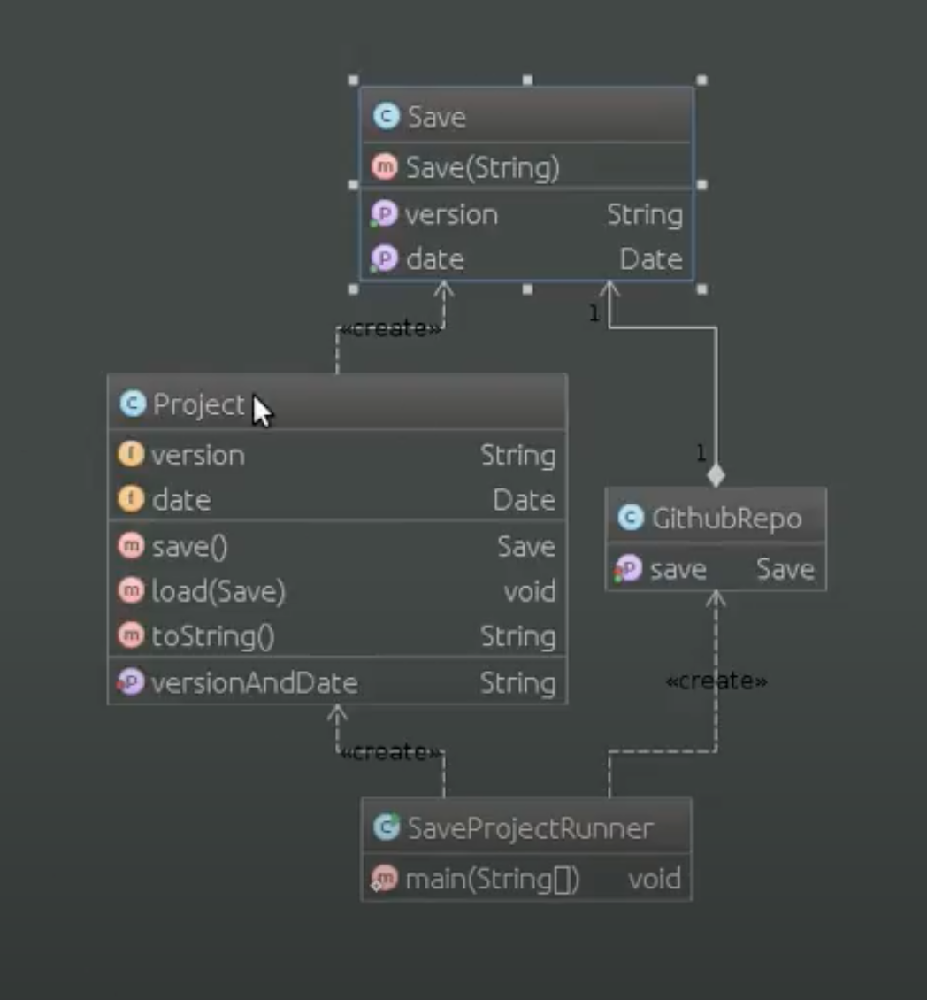

# Шаблон: Хранитель (Memento)

---

## 🎯 Цель

Сохранить внутреннее состояние объекта за его пределы.

---

## 🛠️ Для чего используется

Фиксирование внутреннего состояния объекта за его пределы не нарушая его инкапсуляцию и востановления объекта в случае его необходимости.

---

## 💡 Пример использования

- Необходимо сохранить текущее состояние объекта или его части и востановление в будущем, но прямое получение состояния раскрывает детали реализации и нарушает инкапсуляцию объекта.

---

## Схема шаблона

