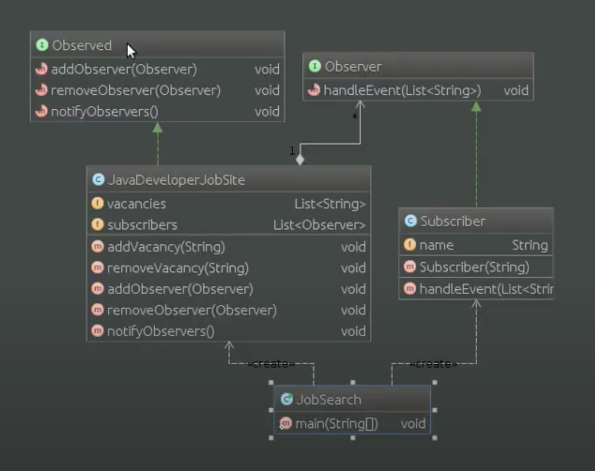

# Шаблон: Наблюдатель (Observer)

---

## 🎯 Цель

Определение зависимости "Один ко многим" между объектами.

---

## 🛠️ Для чего используется

Определение зависимости "Один ко многим" между объектами таким образом, что при изменении состояния одного объекта все зависящие от него объекты были уведомлены об этом и обновились.

---

## 💡 Пример использования

- Когда у модели имеются два аспекта, один из которых зависит от другого. Инкапсулирование этих аспектов в разные классы позволяет использовать их независимо друг от друга.
- Когда один объект должен оповещать другие и не делать предположений об этих объектах.
- Ослабление связи между объектами.

---

## Схема шаблона

