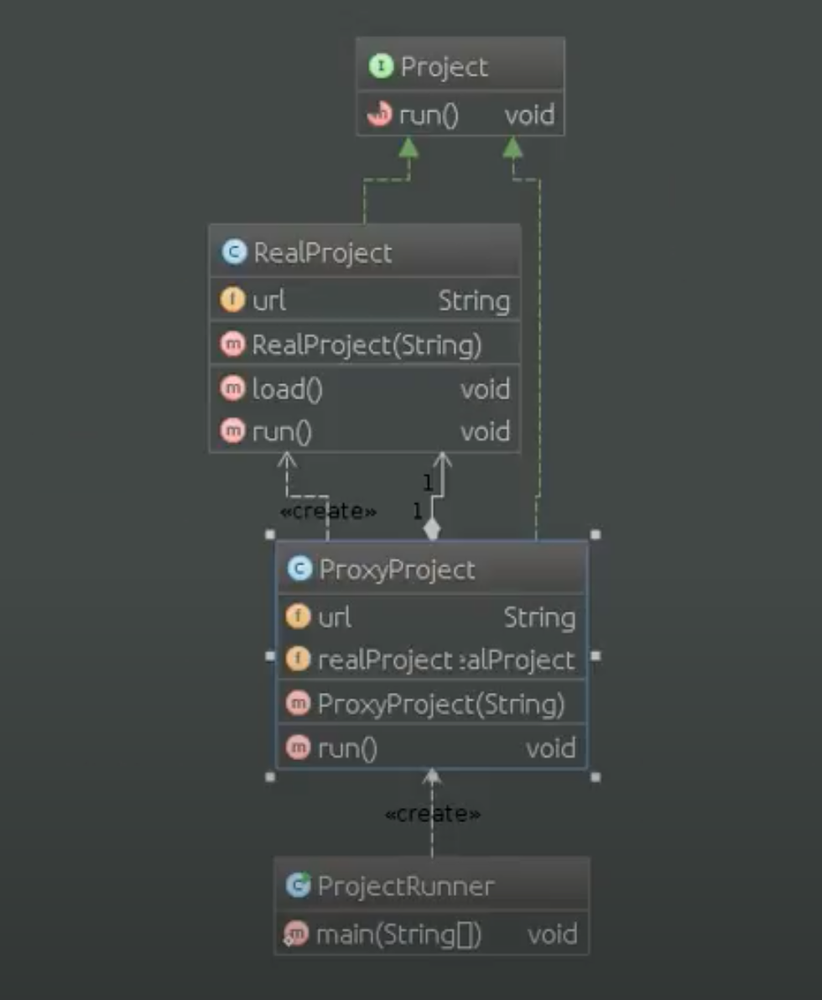

# Шаблон: Прокси (Proxy)

---

## 🎯 Цель

Для замещения другого объекта и контроля доступа к нему.

---

## 🛠️ Для чего используется

Для обеспечения контроля доступа к определенному объекту.

---

## 💡 Пример использования

- Когда есть необходимость ссылаться на объект способом отличным от обычного указателя.
  - Удаленное замещение - локальный представитель вместо объекта в другом адресном пространстве.
  - Виртуальное замещение - создание "тяжелых объектов" ри необходимости.
  - Защищенное замещение - контроль доступа к указанному объекту.
  - "Умная ссылка" - замена обычного указателя (подсчет числа ссылок, установка блокировок и т.д.).

---

## Схема шаблона

