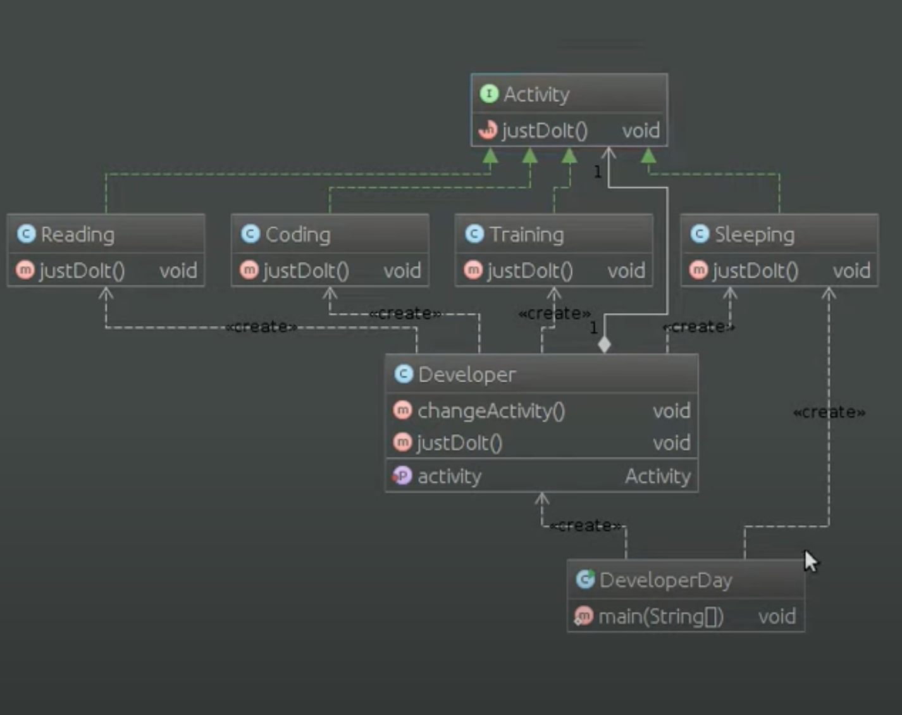

# Шаблон: Состояние (State)

---

## 🎯 Цель

Управление поведением объекта в зависимости от состояния.

---

## 🛠️ Для чего используется

Позволяет нам управлять поведением объекта в зависимости от внутреннего состояния объекта.

---

## 💡 Пример использования

- Поведение объекта зависит от его состояния и изменяется во время выполнения.
- Когда встречается большое количество условных операторов, когда выбор ветыи зависит от состояния объекта.

---

## Схема шаблона

