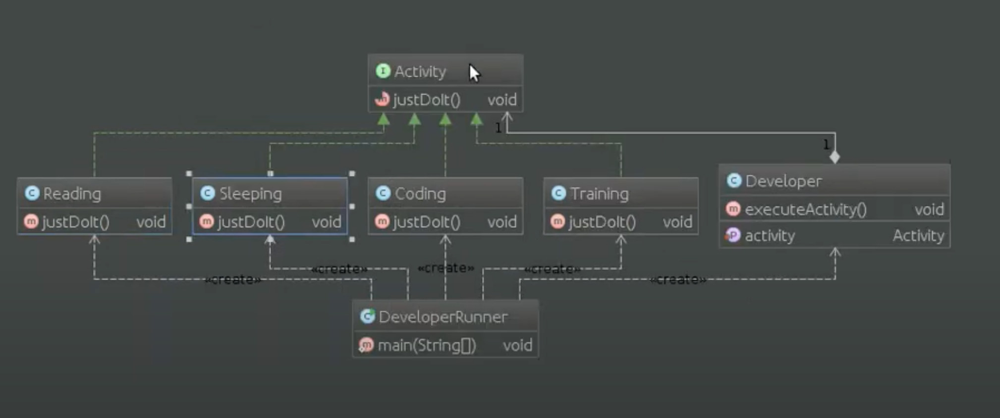

# Шаблон: Стратегия (Strategy)

---

## 🎯 Цель

Взаимозаменяемость семейства классов.

---

## 🛠️ Для чего используется

Определение семейства классов, инкапсулирование каждого из них и организация их взаимозаменяемости.

---

## 💡 Пример использования

- Есть несколько родственных классов, которые отличаются поведением.
- Необходимо иметь несколько вариантов поведения.
- В классе есть данные, о которых не должен знать клиент.
- С помощью условных операторов в классе определено большое количество возможных поведений. 

---

## Схема шаблона

