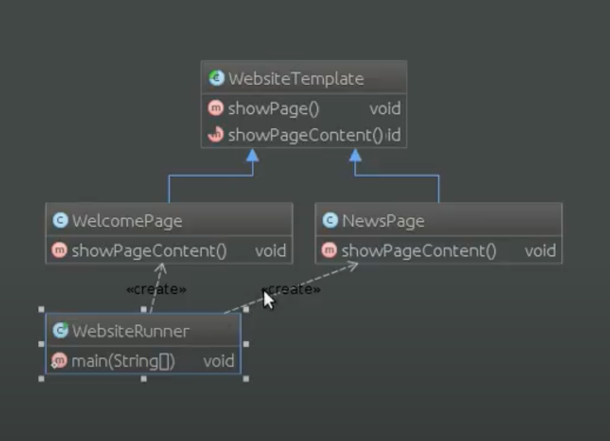

# Шаблон: Шаблонный метод (Template method)

---

## 🎯 Цель

Определение основы класса и создание возможности подклассам переопределять его части.

---

## 🛠️ Для чего используется

Определяет основу класса и позволяет подклассам переопределять некоторые его части не изменяя его структуру в целом.

---

## 💡 Пример использования

- Однократное использование различных частей класса, оставляя реализацию изменяющегося поведения на усмотрение подклассов.
- Вычленение и локализация общего для всех подклассов поведения в родительском.
- Управление расширениями подклассов.

---

## Схема шаблона

