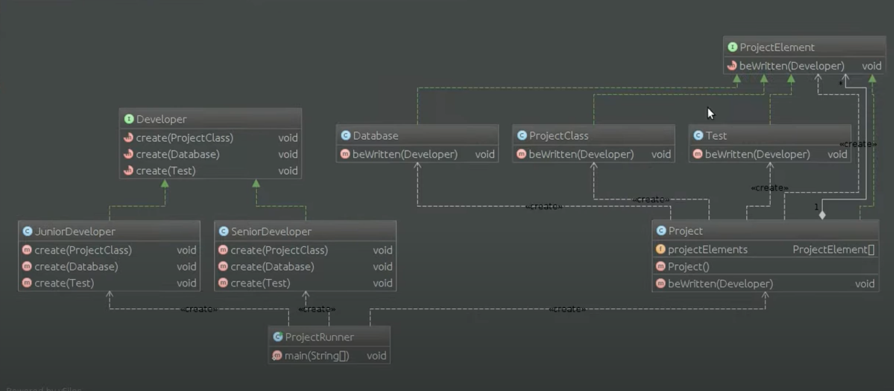

# Шаблон: Посетитель (Visitor)

---

## 🎯 Цель

Описание действий, которые выполняются с каждым объектом в некоторой структуре.

---

## 🛠️ Для чего используется

Описание операций, которые выполняются с каждым объектом из некоторой структуры. Позволяет определить новою операцию без изменения классов этих объектов.

---

## 💡 Пример использования

- В структуре присутствуют объекты многих классов с различными интерфейсами и нам необходимо выполнять над ними операции, которые зависят от конкретных классов.
- Необходимо выполнять не связанные между собой операции над объектами, которые входят в состав структуры и мы не хотим добавлять эти операции в классы.
- Классы, которые устанавливают структуру объектов редко изменяются, но часто добавляются новые операции над этой структурой.

---

## Схема шаблона

